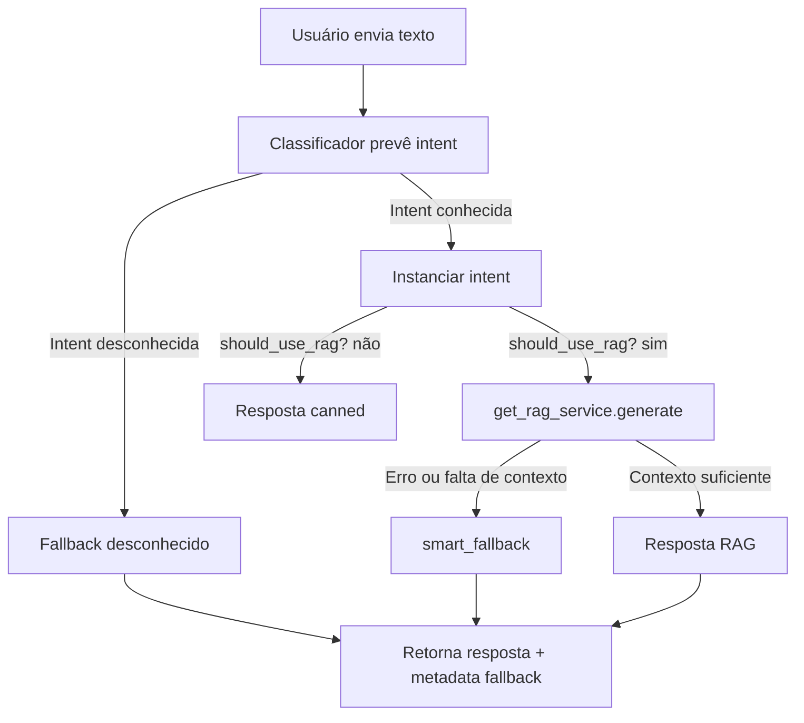

# Fallbacks Inteligentes – Sprint 4

Este documento resume as melhorias implementadas no backend do chatbot Curadobia para lidar com situações em que o modelo não encontra dados suficientes (RAG) ou não reconhece a intenção. O objetivo é oferecer respostas úteis, transparentes e preparar a transição para suporte humano quando necessário.

## 1. Visão Geral

Antes das mudanças, o bot retornava uma mensagem genérica sempre que não identificava uma intenção ou quando o RAG não tinha contexto relevante. Agora, o comportamento é dividido em dois pilares:

1. **Fallback por intenção desconhecida** – Mensagem mais empática, com oferta de ajuda humana.
2. **Fallback orientado por RAG** – Detecção de baixa confiança/ausência de contexto e respostas orientando o usuário a fornecer mais detalhes ou acionar o time.

## 2. Componentes Atualizados

### 2.1 Router (`app/src/router.py`)

- Ajustado para receber histórico recente (`history`) e anexar anotações de personalização.
- Passa a monitorar o payload do RAG (`sufficient_context`, `scores`, `context_count`) e define `fallback_reason` quando não há contexto confiável.
- Registra metadados `{ "fallback": { "type": "rag" | "unknown_intent", ... } }` para observabilidade.

### 2.2 Serviço RAG (`app/src/rag_service.py`)

- Calcula `max_score` e define `sufficient_context` com base em um threshold configurável (`CONFIG['rag']['retriever']['min_score']`).
- Inclui contagem de contextos recuperados, scores e o threshold aplicado.
- Introduz `_clean_answer`, removendo tags como `<answer>`, `<question>` e quaisquer seções que o modelo porventura ecoe.

### 2.3 Intents (`app/src/intent.py`)

- Classe base `Intent` agora possui `smart_fallback`, retornando mensagem padrão que oferece acionamento humano.
- Intents com RAG (ex.: DuvidaProduto, RastreamentoPedido, ProblemaTecnico etc.) sobrepõem `smart_fallback` com textos específicos (“Não encontrei detalhes desse item… quer que eu acione o time?”).

### 2.4 Configuração (`app/src/config.py`)

- Adicionado `min_score` para controlar quando o RAG considera contexto suficiente.

## 3. Fluxo de Decisão

## 4. Exemplos de Respostas

| Cenário | Resposta | Metadados relevantes |
|---------|----------|----------------------|
| Intent desconhecida | “Desculpe, ainda não entendi… posso acionar alguém do time…” | `"fallback": {"type": "unknown_intent"}` |
| RAG sem contexto | “Ainda não encontrei detalhes desse item… você pode mandar o nome completo ou posso chamar o time?” | `"fallback": {"type": "rag", "reason": "no_context"}` + `rag.insufficient_context = true` |
| RAG com contexto | Resposta gerada pelo modelo, limpa via `_clean_answer` | `"rag": {"used": true, "context_count": n, ...}` |

## 5. Observabilidade e Dados Registrados

Cada chamada ao `/chat` agora gera um registro na tabela `interactions` com:

- `input_text`, `response_text`, `intent`, `metadata` (inclui fallback e scores), `user_id` / `external_id`.
- Permite auditar quantas vezes o fallback é acionado e identificar oportunidades de melhoria do modelo.

## 6. Testes

- `tests/test_smart_fallback.py` cobre:
  - fallback por insuficiência de contexto com metadata específica;
  - fallback por intent desconhecida;
  - injeção de histórico e personalização.
- `tests/test_interactions.py` valida persistência e consulta de interações com metadados.

## 7. Próximos Passos Sugeridos

1. **Escalonamento automático** – Integrar fallback com canal humano (e-mail/CRM) quando necessário.
2. **Mensuração de confiança** – Ajustar `min_score` conforme métricas reais e talvez usar média/mediana dos scores.
3. **Feedback loop** – Armazenar mensagens não compreendidas para retraining do classificador.
4. **UX** – Diferenciar fallback no frontend (ex.: destacar quando a resposta veio do time humano).

---

Com esses mecanismos, o chatbot oferece uma experiência mais consistente e transparente, mesmo quando o modelo ou a base de conhecimento não têm informação suficiente, cumprindo o requisito de “fallback inteligente” definido para a sprint.
