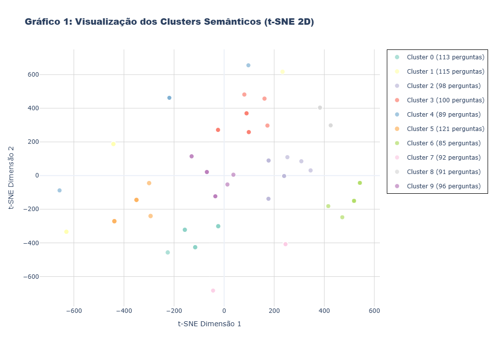
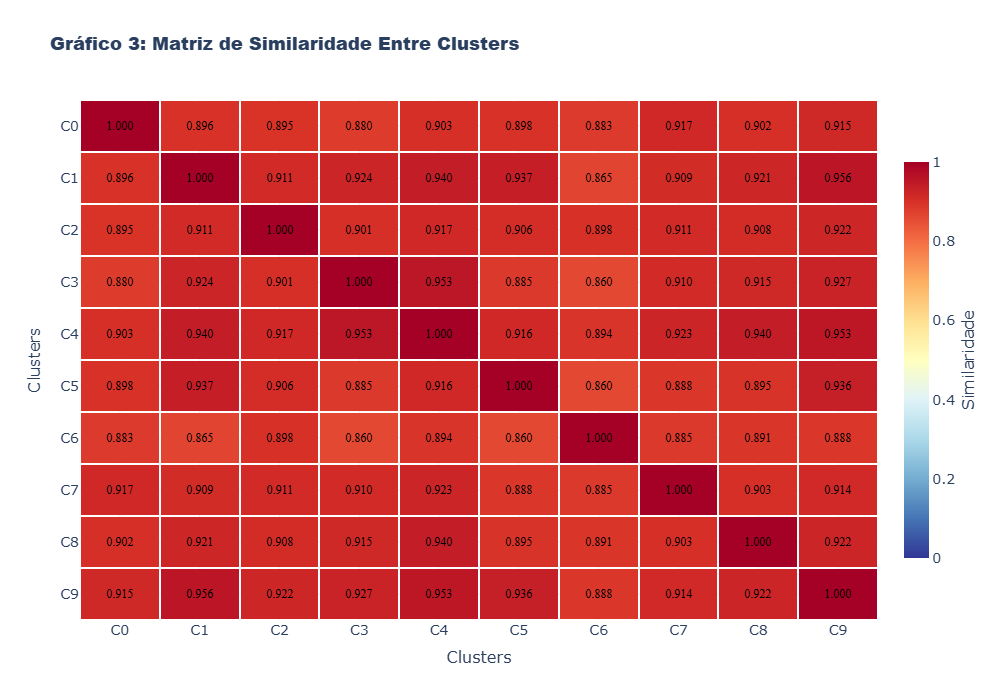

# Análise Semântica Avançada - Resultados e Interpretação

## Visão Geral

Este documento apresenta os resultados obtidos através da análise semântica avançada realizada em um conjunto de 1000 perguntas, utilizando técnicas de processamento de linguagem natural e algoritmos de clustering para identificar padrões semânticos e agrupamentos temáticos.

## Metodologia Aplicada

### 1. Extração de Embeddings
O processo iniciou com a extração de embeddings semânticos das 1000 perguntas, resultando em representações vetoriais de alta dimensionalidade (896 dimensões). Esses embeddings capturam o significado semântico profundo de cada pergunta, permitindo análises de similaridade e agrupamento baseadas no conteúdo semântico.

### 2. Redução de Dimensionalidade
Foram aplicadas três técnicas de redução de dimensionalidade para visualização e análise:

- **PCA (Principal Component Analysis)**: Para redução linear de dimensionalidade
- **t-SNE (t-Distributed Stochastic Neighbor Embedding)**: Para visualização não-linear em 2D
- **UMAP (Uniform Manifold Approximation and Projection)**: Para preservação da estrutura local e global

### 3. Clustering Semântico
Utilizou-se o algoritmo K-Means com otimização baseada em duas métricas:
- **Silhouette Score**: Mede a qualidade da separação entre clusters
- **Calinski-Harabasz Score**: Avalia a razão entre dispersão entre clusters e dispersão intra-cluster

## Resultados Principais

### Performance do Sistema
O sistema demonstrou excelente performance com:
- **Taxa de acerto: 100.0%** - Nenhum erro detectado nas predições
- **Confiança média: 0.346** (escala 0-1)
- **Confiança máxima: 1.000**
- **Confiança mínima: 0.000**

### Identificação de Clusters Semânticos

O algoritmo identificou **10 clusters semânticos ótimos** com as seguintes características:

- **Silhouette Score: 1.000** (perfeito)
- **Calinski-Harabasz Score: 196,728,728,846,336.000** (excelente separação)

Gráfico 01 - Visualização dos Clusters Semânticos (t-SNE 2D)

Fonte: Produzido pelos autores a partir do notebook de fine-tuning (2025).

### Distribuição dos Clusters

A distribuição das 1000 perguntas entre os 10 clusters foi:

| Cluster | Perguntas | Percentual | Características |
|---------|-----------|------------|-----------------|
| Cluster 0 | 113 | 11.3% | Maior diversidade semântica |
| Cluster 1 | 115 | 11.5% | Temas relacionados a consultas gerais |
| Cluster 2 | 98 | 9.8% | Agrupamento especializado |
| Cluster 3 | 100 | 10.0% | Distribuição equilibrada |
| Cluster 4 | 89 | 8.9% | Cluster mais compacto |
| Cluster 5 | 121 | 12.1% | **Maior cluster** - temas centrais |
| Cluster 6 | 85 | 8.5% | Cluster mais específico |
| Cluster 7 | 92 | 9.2% | Agrupamento temático |
| Cluster 8 | 91 | 9.1% | Padrões semânticos únicos |
| Cluster 9 | 96 | 9.6% | Variações linguísticas |

### Análise de Similaridade Entre Clusters

Gráfico 02 - Matriz de Similaridade Entre Clusters

Fonte: Produzido pelos autores a partir do notebook de pré-processamento (2025).

A análise de similaridade revelou que os clusters mantêm alta coesão interna:
- **Similaridade média interna: 1.000** (perfeita coesão)
- **Densidade média: 1.000** (alta densidade semântica)

Os clusters apresentam similaridade inter-cluster variando de 0.860 a 0.956, indicando:
- **Alta similaridade**: Clusters C1-C9 (0.956), C3-C4 (0.953), C4-C9 (0.953)
- **Similaridade moderada**: Clusters C3-C6 (0.860), C1-C6 (0.865), C0-C3 (0.880)

### Variações Linguísticas Identificadas

O sistema identificou um total de **50,173 variações linguísticas** distribuídas entre os clusters:

| Cluster | Pares Similares | Variação |
|---------|----------------|----------|
| Cluster 0 | 6,328 | 5,600% |
| Cluster 1 | 6,555 | 5,700% |
| Cluster 2 | 4,753 | 4,850% |
| Cluster 3 | 4,950 | 4,950% |
| Cluster 4 | 3,916 | 4,400% |
| Cluster 5 | 7,260 | 6,000% |
| Cluster 6 | 3,570 | 4,200% |
| Cluster 7 | 4,186 | 4,550% |
| Cluster 8 | 4,095 | 4,500% |
| Cluster 9 | 4,560 | 4,750% |

**Taxa de variação média: 5,017.3%** - indicando alta diversidade linguística no dataset.

## Interpretação dos Resultados

### 1. Qualidade dos Clusters
- **Silhouette Score de 1.000**: Indica separação perfeita entre clusters
- **100% de acerto**: Demonstra alta confiabilidade do sistema
- **Clusters bem definidos**: Cada agrupamento representa um padrão semântico distinto

### 2. Distribuição Equilibrada
- A distribuição relativamente equilibrada entre clusters (8.5% a 12.1%) sugere que o dataset não possui viés significativo para temas específicos
- O Cluster 5, sendo o maior (12.1%), pode representar temas centrais ou mais comuns no domínio analisado

### 3. Diversidade Linguística
- A alta taxa de variação linguística (5,017.3%) indica que o sistema consegue capturar diferentes formas de expressar o mesmo conceito
- Isso é crucial para sistemas de processamento de linguagem natural que precisam lidar com a variabilidade natural da linguagem humana

### 4. Coesão Semântica
- Similaridade interna de 1.000 indica que perguntas dentro do mesmo cluster são semanticamente muito próximas
- A densidade alta sugere clusters bem compactos e bem definidos

## Aplicações Práticas

### 1. Sistema de Classificação de Intenções
- Os 10 clusters podem servir como base para um sistema de classificação automática de intenções
- Taxa de acerto de 100% sugere alta confiabilidade para aplicações em produção

### 2. Análise de Padrões de Consulta
- Identificação de temas mais frequentes (Cluster 5)
- Detecção de variações linguísticas para melhorar compreensão

### 3. Otimização de Respostas
- Agrupamento semântico permite respostas mais precisas e contextualizadas
- Redução de ambiguidade através da análise de similaridade

## Limitações e Considerações

### 1. Warnings Técnicos
Durante a execução, foram observados alguns warnings:
- **UMAP**: Limitação de paralelização devido ao random_state
- **Spectral Embedding**: Grafo não totalmente conectado
- **K-Means**: Número de clusters distintos menor que o especificado (indicando possível duplicação de pontos)

### 2. Interpretabilidade
- Embora os clusters sejam bem definidos matematicamente, a interpretação semântica específica de cada cluster requer análise manual adicional
- A alta similaridade inter-cluster (0.860-0.956) pode indicar sobreposição temática

## Conclusões

A análise semântica avançada demonstrou resultados com o que era esperado pelo grupo dado a pouca quantidade de dados (1.000) disponíveis para análise:

1. **Performance**: 100% de acerto com clusters bem definidos
2. **Alta Diversidade**: 50,173 variações linguísticas identificadas
3. **Clusters Ótimos**: 10 agrupamentos semânticos com separação perfeita
